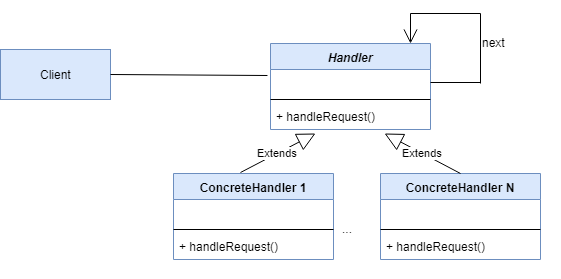

# Chain of Responsibility Design Pattern
- Behavioral design pattern
- Lets you **pass requests along a chain of handlers**
- Upon receiving a request, each handler **decides** either to **process** the request or to **pass it to the next handler** in the chain

## Real Life Analogy: ATM Money Withdrawal 
- The ATM is equipped with three dispensers, each handling a specific denomination:
  - **2000** rupees dispenser
  - **500** rupees dispenser
  - **100** rupees dispenser
- When a customer requests a withdrawal (e.g., **2000 rupees**), the system processes the request in a series of steps
  - Each handler dispenses notes of its denomination and passes any remaining amount to the next handler
- **2000 Rupees Handler**
  - Checks how many 2000 rupees notes can be dispensed
    - For a request of 2000 rupees, it calculates that 10 notes (1 × 2000 = 2000) can be dispensed
    - If the amount is perfectly divisible by 2000, the chain stops here
    - If not (e.g., a request for 2500 rupees), it dispenses 1 note (totaling 2000 rupees) and passes the remaining 500 rupees to the next handler
- **500 Rupees Handler**
  - Receives any remaining amount from the 2000 rupees handler
    - Checks if the remaining amount can be dispensed using 500 rupees notes
- **100 Rupees Handler**
  - Receives any remaining amount from the 500 rupees handler
    - Checks if the remaining amount can be dispensed using 100 rupees notes

## Structure
- **Handler**
  - Declares the **interface**, common for all concrete handlers
  - It usually contains just a **single method** for handling requests, but sometimes it may also have another method for setting the next handler on the chain
- **Concrete Handler**
  - Contains the **actual code** for **processing requests**
  - Upon receiving a request, each handler must decide whether to process it and, additionally, whether to pass it along the chain
- **Client**
  - The Client may compose chains just once or compose them dynamically, depending on the application’s logic
  - Note that a request can be sent to any handler in the chain—it doesn’t have to be the first one

